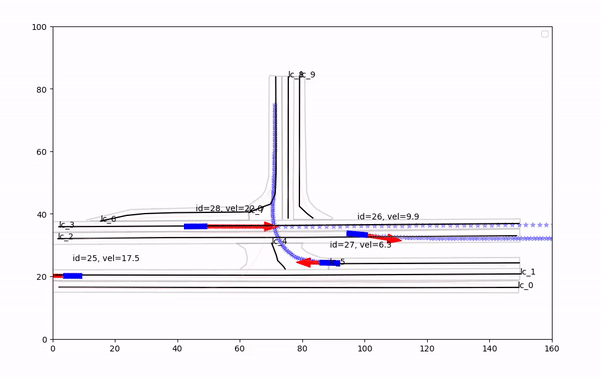

# CitySim-ROS-Interface

[Updated: Apr. 11, 2023]

**CitySim-ROS-Interface** is designed to be a plug-in python interface that works with prediction modules developed in prediction_ct_vel repo. Its function includes
1. Code that imports Citysim trajectory dataset, extract lane center and states of all vehicles and transform it to ROS bags interpretable for predictor rosnodes.
2. A visualization rosnode that show brid view of traffic in multiple scenarios.  
3. ADE, FDE Evaluation  

## demo here


## Prerequisites
- Python 3.8
- [Carla 0.9.11](https://github.com/honda-research-institute/carla-setup/tree/0.9.11)
- [prediction_ct_vel]()
- [ROS Noetic](http://wiki.ros.org/noetic/Installation)


## Download Carla Simulator and setup the workspace

Use Carla version 0.9.11 with Python 3.8 kernel here.

1. Download the version 0.9.11 release from https://github.com/carla-simulator/carla/releases/tag/0.9.11.

2. Setup environment variables

Include CARLA Python API to the Python path:

```
export CARLA_ROOT=/path/to/your/carla/installation
export PYTHONPATH=$PYTHONPATH:${CARLA_ROOT}/PythonAPI/carla
export PYTHONPATH=$PYTHONPATH:${CARLA_ROOT}/PythonAPI/carla/agents
export PYTHONPATH=$PYTHONPATH:${CARLA_ROOT}/PythonAPI/carla/dist/carla-0.9.11-py3.7-linux-x86_64.egg
```

Additional path might need adding, listed for reference:

```
export PYTHONPATH=$PYTHONPATH:/path/to/your/carla-setup/catkin_ws/src/carla_setup_src/msgs/ #Adds the path to the Carla ROS message definitions to the PYTHONPATH environment variable.

export UE4_ROOT=/path/to/your/UE4/installation # Sets the UE4_ROOT environment variable to the path where the Unreal Engine is installed.

source /opt/ros/noetic/setup.bash # Sets up the environment for ROS (Robot Operating System).

source /path/to/your/carla-setup/catkin_ws/devel/setup.bash #Sets up the environment for the Carla ROS bridge.

```

## Build prediction nodes
1. Clone the repository and switch to branch  `xinyi`
```
git clone https://github.com/honda-research-institute/prediction_ct_vel.
git checkout xinyi
```

detailed procedure are listed in the prediction_ct_vel module, but after that, you should be able to run separate nodes by the following command:
```
rosrun prediction_ct_vel prediction_ct_vel_node
```
## Download the dataset from CitySim Dataset
change directory to `dataset/` and then download the up-to-date dataset requires submitting a form to the contributor. Or you could use pre-downloaded version that was stored [here](https://drive.google.com/drive/folders/1q5kUhhvDclF7mSVYR0h6VAvPqJ4G6mVl?usp=share_link) (updated till April 12). 
```
cd dataset
pip install gdown
gdown https://drive.google.com/drive/folders/1q5kUhhvDclF7mSVYR0h6VAvPqJ4G6mVl?usp=share_link
```


## Transform CitySim data to ROS bags
Run python file:

```
cd /path/to/CitySim/
python bag_from_citysim.py
```
 remember to specify the data csv file with the corresponding lane boundary .npy file in the code.


## Visualizing the dataset: 
```
chmod +x run_eval.sh
./run_sim_time.sh
```
This will give you a demo like the following



## Running evaluation
```
chmod +x run_sim_time.sh 
./run_eval.sh
```
This will yield 

- standard ADE, FDE result in the terminal.

- Error distribution plots for ADE and FDE.


